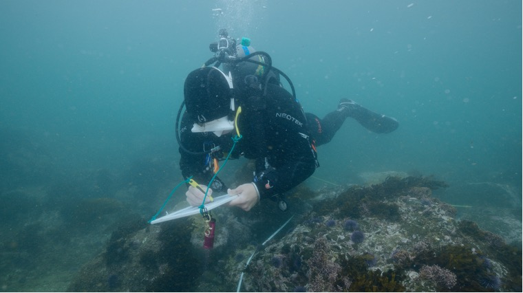
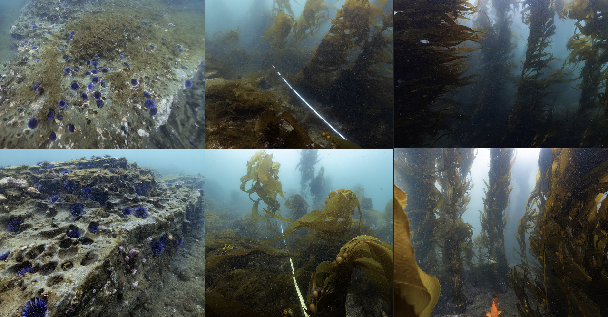

{fig-align="left" width="1278"}

## [Palos Verdes Kelp Forest Restoration Project](https://www.santamonicabay.org/what-we-do/projects/kelp-forest-restoration-project/)

Large-scale urchin culling restoration project off the Palos Verdes Peninsula started in 2013 that has cleared over 80 acres of of urchin barren to date. I serve as the current manager of the program and dive lead for field operations. The Bay Foundation (TBF) is a world leader in the effort to restore kelp forests, supporting international partnerships, method development, and technological innovation.

### Related News:

[**CNN:** How underwater heroes are saving out kelp forests \| Earth Month](https://www.cbsnews.com/losangeles/video/how-underwater-heroes-are-saving-out-kelp-forests-earth-month/)

[**USC:** “The forgotten forest”: How urchin-hunters help California’s kelp forests bounce back](https://dornsife.usc.edu/wrigley/2025/08/31/the-forgotten-forest-how-urchin-hunters-help-californias-kelp-forests-bounce-back/)

[**Smithsonian:** Underwater Forests Return to Life off the Coast of California, and That Might be Good News for the Entire Planet](https://www.smithsonianmag.com/science-nature/underwaer-forests-return-life-coast-california-might-be-good-news-entire-planet-180987639/)

{fig-align="left"}

## [Eelgrass Restoration](https://www.santamonicabay.org/what-we-do/projects/eelgrass-research-and-restoration-program/)

Eelgrass (*Zostera* spp.) is a marine flowering plant that forms “meadows” and is found in temperate regions throughout the world. TBF and project partners are working to restore eelgrass meadows while researching the plant and its habitat. Eelgrass are economically and ecologically valuable marine habitats. I serve as the current manager of this program and dive lead for field operations. Read more about our success with a first of it's kind transplant [here](https://cms.santamonicabay.org/wp-content/uploads/Sanders-et-al.-2026-ButtonShell.pdf).

{fig-align="left" width="1278"}

## [Abalone Restoration](https://www.santamonicabay.org/what-we-do/projects/abalone-restoration-program/)

The kelp forests of Santa Monica Bay once teemed with seven species of abalone—red, pink, green, white, black, pinto, and flat. Through overharvesting in the past century, loss of kelp habitat, and disease, all seven species found in southern California have been nearly wiped out. TBF and project partners support the recovery of white and red abalone through the outplanting of capitvely breed juveniles onto the reef. To date 3,601 juvenile white abalone and 2,707 juvenile red abalone have been outplanted. Check out this [video](https://youtu.be/npzwb5CvZxs) to see what we are up to. I serve as an AAUS scientific diver on this project, preforming outplanting procedures and monthly SCUBA surveys.

{fig-align="left" width="1278"}

## [AAUS Volunteer Diver Program](https://www.santamonicabay.org/what-we-do/projects/volunteer-divers/)

Created and lead TBF's official volunteer diving program that allows local AAUS divers to contribute to our various restoration projects and gain valuable field experience. I have been able to build the program from outreach with local universities, aquariums, and non-profits. We currently have over 70 onboarded divers who have contributed over 1,000 hours of volunteer dive effort to our kelp forest restoration project. Find out how to apply [here.](https://www.santamonicabay.org/what-we-do/projects/volunteer-divers/)

.jpg){fig-align="left" width="1278"}

## Thesis Research

My project will quantify fine-scale temporal and spatial patterns of macroalgal and invertebrate assemblage recovery during the first six months following urchin culling at two sites, White Point and Point Fermin, off the Palos Verdes Peninsula. The study will evaluate the timeline of transition from urchin barren to kelp dominated habitat, assess whether changes in invertebrate assemblages, particularly mobile gastropod grazers, are associated with faster kelp recovery, and test whether recovery differs spatially within restoration sites.
