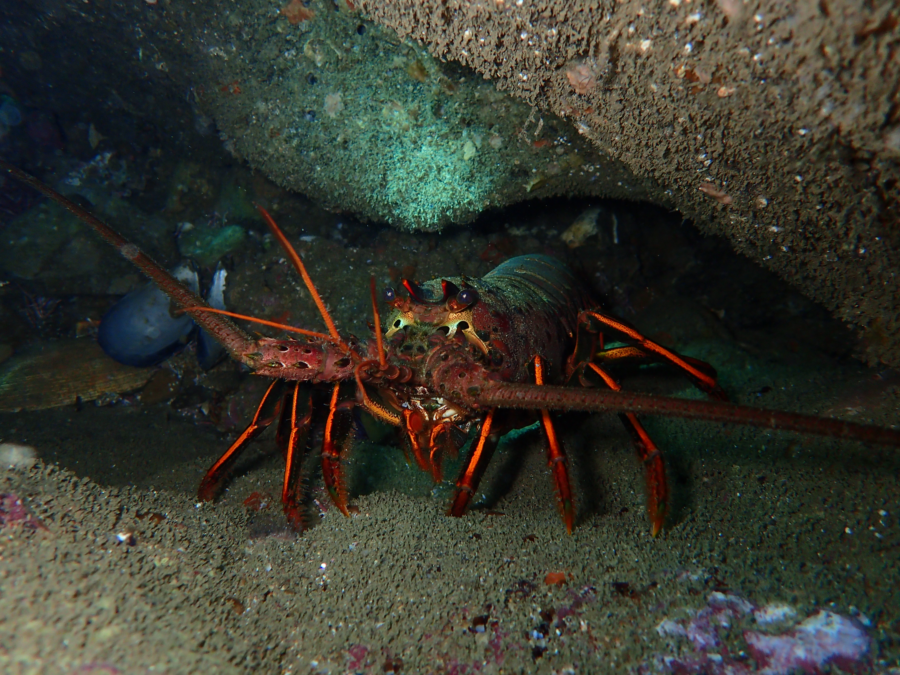
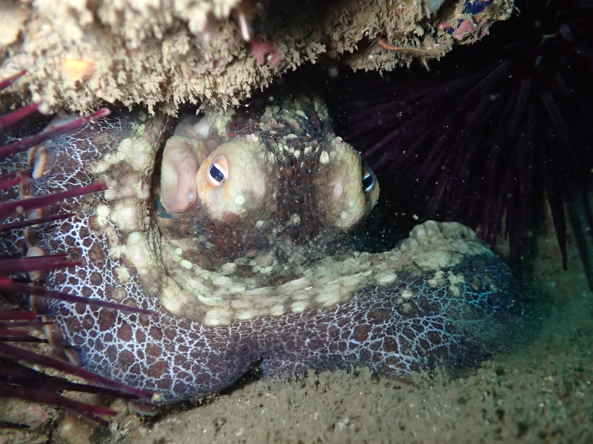
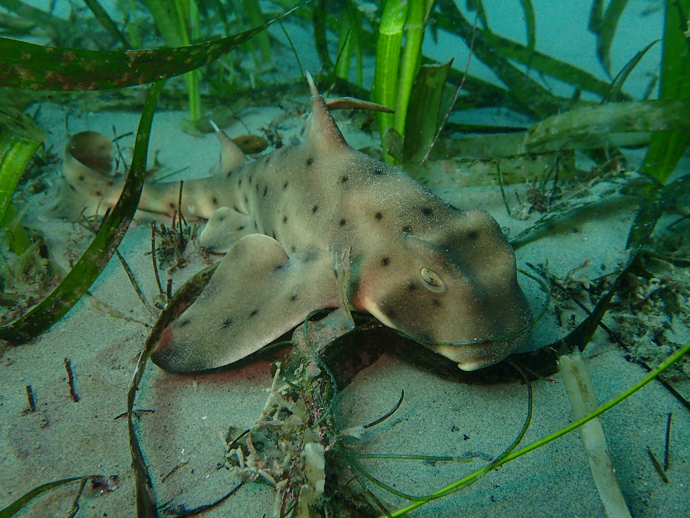
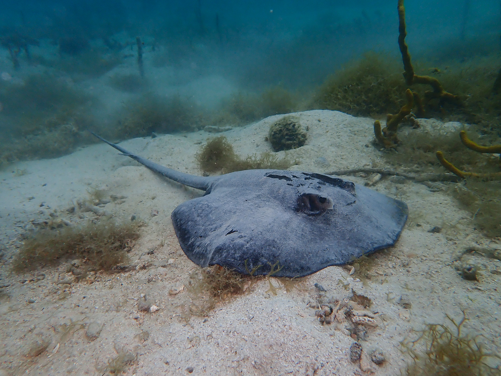
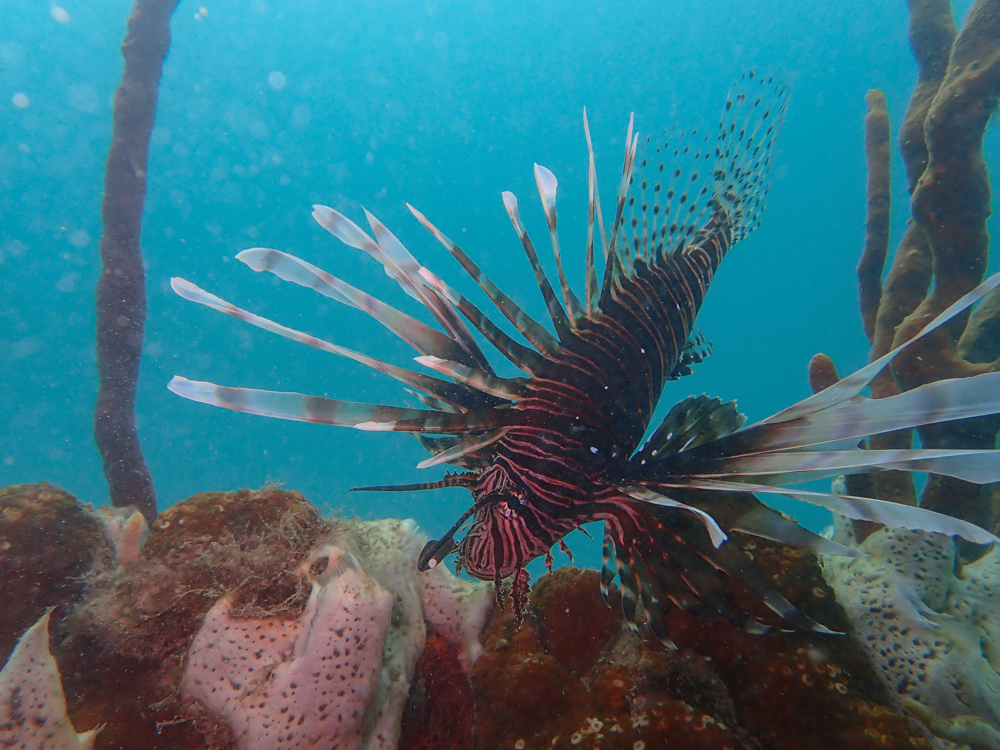
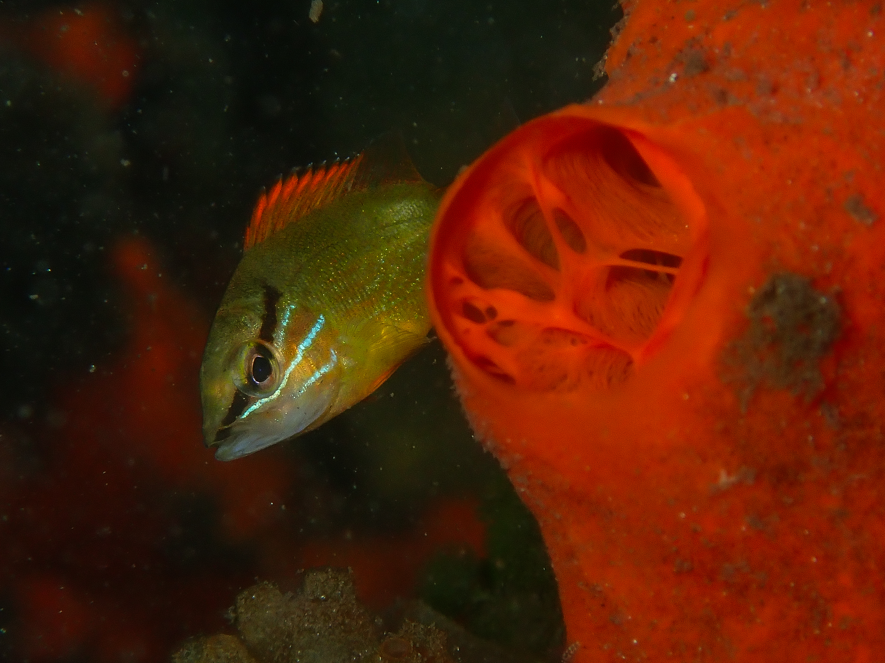

## Certifications

-   AAUS Certified Scientific Diver

    -   600+ professional dives in the Southern California Bight

    -   120ft AAUS depth certification

-   NAUI Dive Master

-   Nitrox Certified

-   DAN First Aid, AED, CPR, and Oxygen Provider for Professional Divers

-   HAZMAT fill station operator

## Additional Working Experience

University of Southern California Resource Diver: January 2022 – Present

-   Help train and certify new AAUS scientific divers at Wrigley Marine Science Center. Serve as a dive master and assist with seminars.

## Photographs

### California

### Panama

